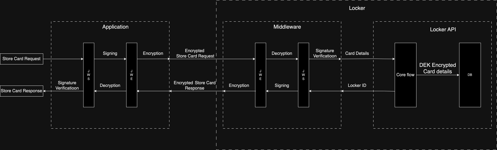
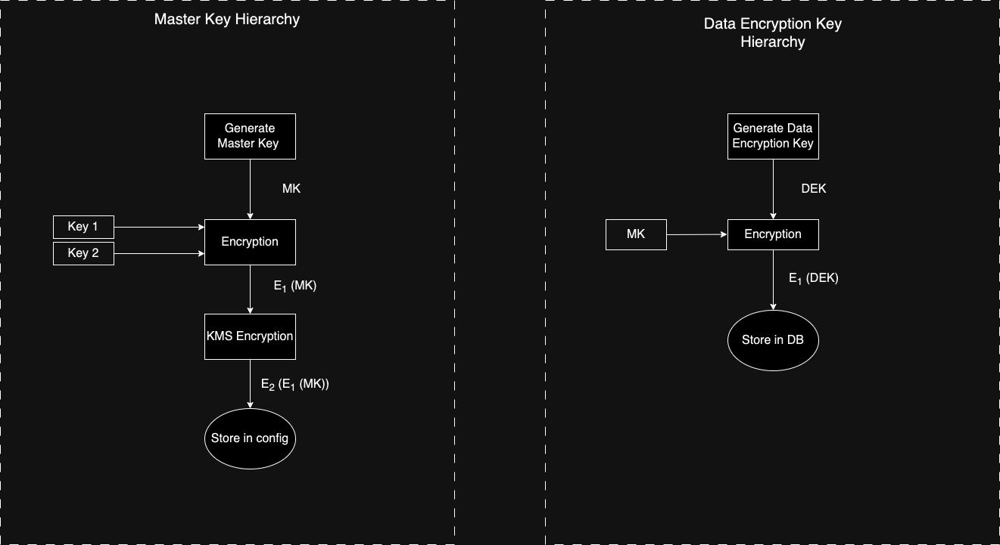

# Tartarus - Rust Locker

## Overview

The Hyperswitch Card Vault (Tartarus) is a highly performant and a secure vault to save sensitive data such as payment card details, bank account details etc.

It is designed in an polymorphic manner to handle and store any type of sensitive information making it highly scalable with extensive coverage of payment methods and processors.

Tartarus is built with a GDPR compliant personal identifiable information (PII) storage and secure encryption algorithms to be fully compliant with PCI DSS requirements.

Here's a quick guide to [Get Started](./docs/guides/setup.md) with setting up Tartarus.

### How does Tartarus work?

- Your application will communicate with Tartarus via a middleware.
- All requests and responses to and from the middleware are signed and encrypted with the JWS and JWE algorithms.
- The locker supports CRD APIs on the /data and /cards endpoints - <API Reference to be linked>
- Cards are stored against the combination of merchant and customer identifiers.
- Internal hashing checks are in place to avoid data duplication.

### Key Hierarchy

- Master Key - AES generated key to that is encrypted/decrypted by the custodian keys to run the locker and associated configurations.
- Custodian Keys - AES generated key that is used to encrypt and decrypt the master key. It broken into two keys (key 1 and key 2) and available with two custodians to enhance security.

### Setup Guide

Follow this guide to setup Tartarus - [Get Started](./docs/guides/setup.md)
